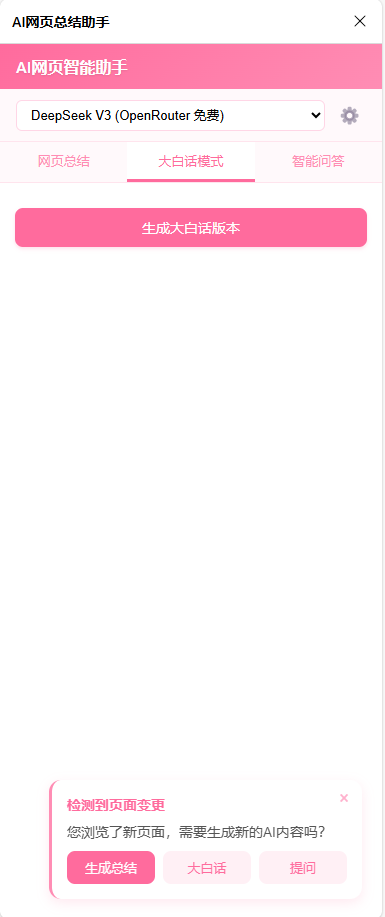
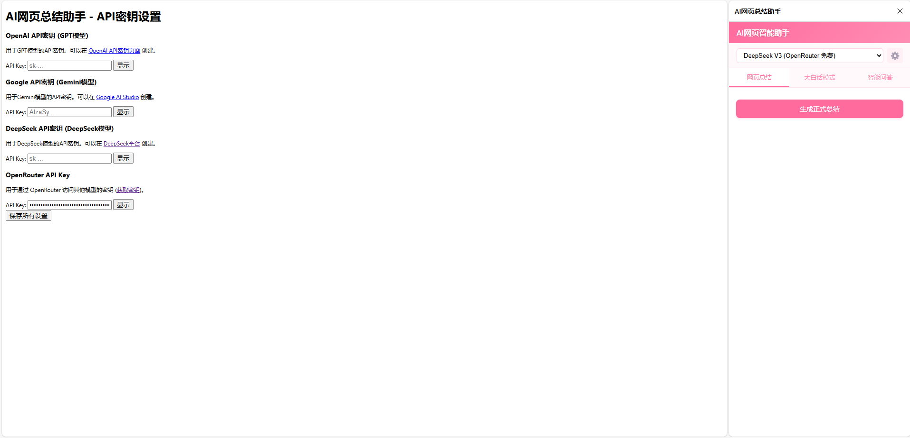

# AI网页助手

一款智能浏览器扩展，利用AI技术提供网页内容总结、B站视频分析和智能聊天功能。

## 🌟 主要功能

### 📑 网页内容智能总结
- **正式总结**：简洁专业的网页内容概述
- **大白话版本**：通俗易懂的内容解释，适合快速理解复杂概念

### 🎬 B站视频智能分析
- **视频内容总结**：自动提取并分析B站视频字幕，生成核心内容概要
- **视频大白话**：将视频内容转换为通俗易懂的语言

### 💬 智能AI聊天
- **上下文感知对话**：基于当前网页内容的智能交互
- **提问解答**：针对网页/视频内容的任何问题获取即时回答
- **便捷的编辑和复制功能**：轻松修改问题和保存对话记录

## 📦 安装方法

### Chrome/Edge 浏览器
1. 下载最新发布的扩展文件 (.zip)
2. 解压到本地文件夹
3. 打开浏览器，进入扩展管理页面（chrome://extensions 或 edge://extensions）
4. 启用"开发者模式"
5. 点击"加载已解压的扩展"，选择解压后的文件夹

### Firefox 浏览器
1. 下载最新的 .xpi 文件
2. 在 Firefox 中打开 about:addons
3. 从文件安装附加组件，选择下载的 .xpi 文件

## 🔑 API密钥设置

为了使用AI网页助手的功能，您需要设置API密钥：（推荐使用原生deepseek，费用低；Openrouter的Llama4、deepseek，免费但是有限制每日额度；谷歌Gemini也有免费额度自行了解）

1. **获取API密钥**
   - 访问您选择的AI服务提供商网站（如OpenAI、OpenRouter等，扩展设置界面可直接点击带颜色字体访问）
   - 注册/登录您的账户
   - 在开发者或API设置页面生成新的API密钥

2. **设置API密钥**
 
   - 点击浏览器工具栏中的扩展图标
   - 点击设置图标（⚙️）进入设置页面
   - 在"API设置"部分找到密钥输入框
   - 输入您的API密钥并保存

4. **安全说明**
   - API密钥仅保存在您的浏览器本地，不会上传到云端
   - 请勿与他人分享您的API密钥
   - 建议定期更换API密钥以确保安全
## 🚀 使用指南

### 网页总结
1. 浏览任意网页时，点击浏览器工具栏中的扩展图标
2. 在打开的侧边栏中，点击"生成正式总结"按钮
3. 稍等片刻，AI将生成网页内容的摘要
4. 可切换到"大白话"标签，获取通俗易懂的版本

### B站视频分析
1. 在B站视频页面打开扩展
2. 点击"分析视频内容"按钮
3. 扩展会自动提取视频字幕并进行内容分析
4. 切换到"大白话"标签可获取简易版本的视频解释

### AI对话功能
1. 切换到"对话"标签
2. 在输入框中输入您的问题
3. AI会基于当前网页/视频内容回答问题
4. 可使用编辑按钮修改已发送的问题
5. 使用复制按钮保存单条回复或整个对话记录

## ⚙️ 技术实现

- **前端**：纯原生JavaScript，无框架依赖
- **AI技术**：接入多种大语言模型，支持自定义模型选择
- **字幕分析**：针对B站视频的特殊字幕提取算法
- **UI设计**：响应式设计，流畅的过渡动画和用户反馈
- **流式输出**：支持AI回答的实时流式生成
- **智能滚动**：自适应的内容滚动控制，带有便捷的"回到底部"功能

## 🛡️ 隐私与安全

- 扩展仅在用户主动点击按钮时才会分析当前页面
- 所有内容分析和AI处理均在本地或通过安全API完成
- 不会永久存储用户浏览历史或网页内容
- 聊天记录仅保存在浏览器本地，不会上传到云端

## 🔍 未来计划

- [ ] 支持更多视频平台（优酷、腾讯视频等）
- [ ] 添加文章结构化分析功能
- [ ] 导出总结为多种格式（MD、PDF）
- [ ] 提供更多个性化设置选项
- [ ] 支持更多语言模型和自定义提示词

## 🤝 贡献指南

欢迎提交Issues和Pull Requests来帮助改进项目！

## 📄 许可证

本项目采用 MIT 许可证 - 详情请查看 [LICENSE](LICENSE) 文件

## 📧 联系方式

如有任何问题或建议，请通过以下方式联系我：

- 电子邮件：1624899229@qq.com
- GitHub：[https://github.com/1624899]

---

**AI网页助手** - 让网页浏览与视频观看变得更加智能高效！
